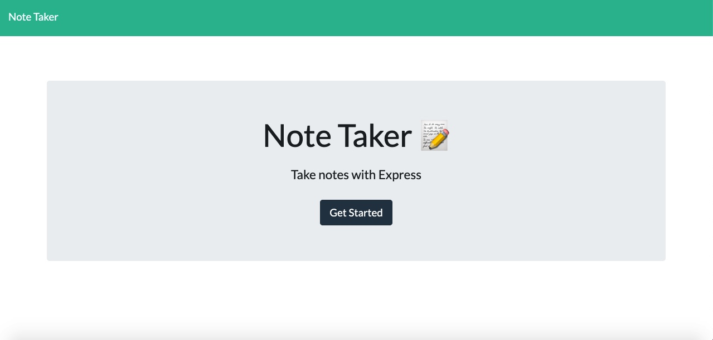
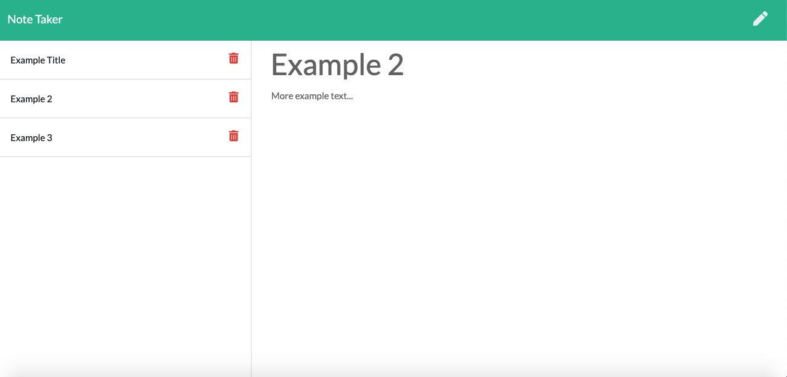

# Notes Application
## Description: 
This is a notes application that allows you to write, save, view and delete notes with ease.
## Table Of Contents:
* How To Install
* Usage
* Technology Used/Badges
* Contributors
* Tests
* GitHub
## How To Install: 
All you need is a web browser!
## Usage:
Meant for poeple who need to write something down in order to not forget it.
Deployed link: https://morning-badlands-29426.herokuapp.com/notes

## Technologies Used/Bagdes: 

## Lisence:  
MIT
## Contributors:
Edwin Genova
## Tests:
None.
## GitHub: 

